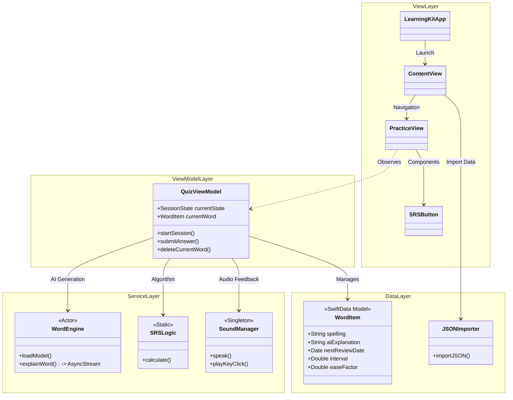
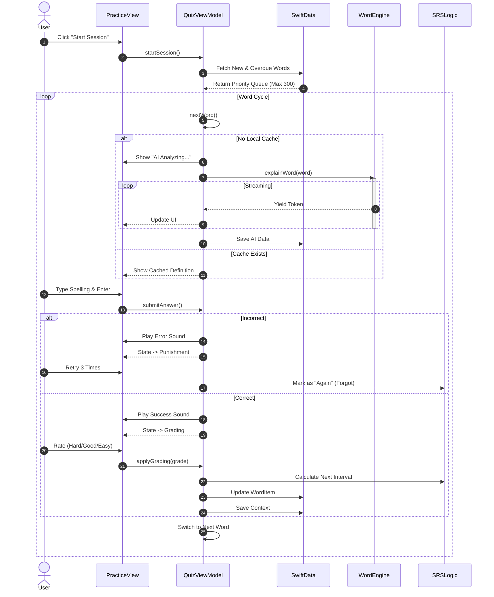
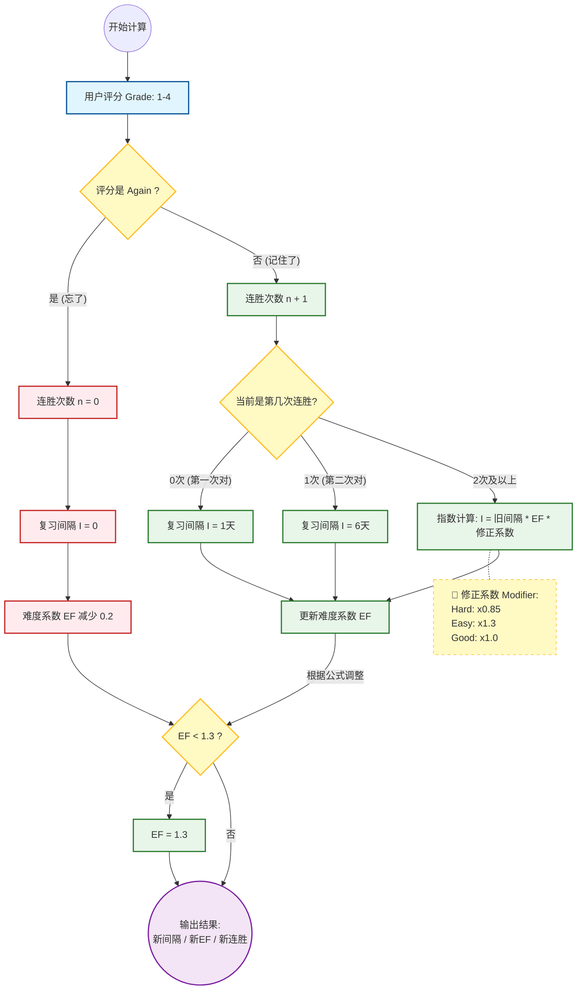

# LearningKit: A Native macOS Vocabulary Trainer for Geeks
LearningKit 是一款专为 macOS 打造的极客背单词应用。它摒弃了传统移动端 App 的碎片化学习方式，结合 键盘肌肉记忆、``本地大模型 (Local LLM)`` 以及 ``间隔重复算法 (SRS)``，为你提供高强度、沉浸式的语言学习体验。

## 简介与核心优势
### 解决什么问题？
- **输入匮乏**：大多数背单词软件只是“看”和“选”，缺乏拼写输出，导致“提笔忘字”。

- **释义死板**：传统词典的解释往往脱离语境，缺乏生动的例句。

- **平台限制**：市面上缺乏优秀的、利用桌面端优势（键盘、大屏、算力）的原生 Mac 应用。

### 核心优势
- 沉浸式键盘交互 (Keyboard-First Experience)

    - 肌肉记忆：强制要求完整拼写单词，配合机械键盘音效反馈，让指尖记住单词。

    - 极简 UI：无干扰的全屏/大窗口设计，超大字号输入，专注于单词本身。

    - 惩罚机制：拼写错误触发“惩罚模式”，强制重新输入，直到形成正确记忆。

- 本地 AI 智能助教 (On-Device AI with MLX)

    - 隐私与离线：基于 Apple MLX 框架，运行本地 Llama 3 等大模型，无需联网，无需 API 付费。

    - 动态释义：AI 不是简单翻译，而是生成结构化的 JSON 数据（英文释义、同义词、语境例句），并自动存入数据库。

    - 懒加载补全：导入时无需完整数据，AI 会在你复习时自动补全缺失的例句和解释。

- 科学记忆算法 (SM-2 SRS)

    - 内置经典的 SuperMemo-2 间隔重复算法。

    - 根据你的反馈（Again, Hard, Good, Easy）动态调整复习间隔。

    - 智能调度：优先复习“从未学过”的生词，单次 Session 智能截断（如限制 300 词），避免认知过载。

- 数据完全掌控 (BYOD - Bring Your Own Data)

    - 支持导入自定义 JSON 词书（如从有道词典、Kindle 导出的生词本）。

    - 所有数据存储在本地沙盒 (Application Support)，支持随时清空或重建。

## 工程架构
本项目采用 Swift 5.10+ 和 SwiftUI 开发，架构遵循 MVVM 模式，并结合了 Actor 模型处理高并发 AI 任务。


### 模块划分
- A. 表现层 (UI Layer)
    - ``ContentView``: 应用的主入口与仪表盘。负责展示单词列表、处理文件导入 (JSON/Model) 以及导航管理。
    - ``PracticeView``: 核心训练界面。采用 ZStack 分层布局：
        - 底层：背景渲染。
        - 中层：``answerView``（核心交互区），包含动态的问题展示（AI 解释/中文兜底）和超大字号输入框。
        - 顶层：``topBar（HUD）``，悬浮显示进度（如 15/300）、TTS 朗读按钮和删除归档按钮。

- 组件: ``SRSButton`` (带 Hover 动画的评分卡片), ``GradeButton``。

- B. 逻辑层 (ViewModel Layer)
    - ``QuizViewModel``: 整个 App 的大脑，管理状态机（State Machine）。

    - 状态管理: ``idle (空闲)`` -> ``questioning (提问)`` -> ``punishment (罚写)`` -> ``grading (评分)``。

    - 复习队列: ``startSession`` 方法实现了复杂的调度逻辑——优先提取 ``lastReviewDate == nil`` 的新词，其次是到期的旧词，并限制单次 ``Session`` 总量。

    - AI 桥接: 负责调用 ``WordEngine``，处理流式文本，清洗 JSON 数据，并更新到 WordItem。

- C. 数据层 (Data Layer)
    - WordItem (@Model): ``SwiftData`` 的实体类。

        - 存储单词本身 (spelling)、导入的中文释义 (chineseDefinition)。

        - 存储 AI 生成的缓存数据 (``aiExplanation``, ``aiExampleSentence``, ``aiSynonym``)。

        - 存储 SRS 算法指标 (``interval``, ``easeFactor``, ``repetitionCount``, ``nextReviewDate``)。

    - JSONImporter: 处理外部数据导入，包含去重逻辑。

- D. 智能层 (Intelligence Layer)
    -  ``WordEngine (Actor)``: 封装了 ``MLX (Machine Learning Explore)`` 框架。

    - 线程安全: 使用 ``Swift Actor`` 确保并发安全。

    - ``Prompt Engineering``: 包含精心设计的 Prompt (buildVocabPrompt)，强制 ``LLM`` 输出符合规范的 JSON 格式（包含定义、例句、同义词）。

    - ``Streaming``: 通过 ``AsyncStream`` 将 LLM 的推理结果实时推送到 UI，实现“打字机”效果。

- E. 基础设施 (Infrastructure)
    - ``SRSLogic``: 纯算法类，实现了 SM-2 公式，输入评分和当前状态，输出下一次复习时间。

    - ``SoundManager``: 单例模式，负责播放机械键盘音效 (NSSound) 和单词发音 (AVSpeechSynthesizer)。

### 2.2 关键通信流程 (Data Flow)

- 开始复习: User 点击 ``Start Session`` -> ``QuizViewModel`` 查询 ``SwiftData`` -> 筛选出 Top 300 单词 -> 进入 ``questioning`` 状态。

- AI 内容生成: 切换到新单词 -> ``ViewModel`` 检查是否有缓存 -> 若无，调用 ``WordEngine`` -> ``WordEngine`` 加载本地模型 -> 流式返回 ``Token`` -> ``ViewModel`` 实时更新 UI -> 生成结束，解析 JSON 并存入数据库。

- 用户交互循环:

    - User 输入拼写 -> ViewModel 校验。

    - 正确: 播放成功音效 -> 进入 ``grading`` 状态 -> User 选择难度 -> ``SRSLogic`` 计算下次日期 -> 保存数据库 -> 下一词。

    - 错误: 播放失败音效 -> 进入 ``punishment`` 状态 -> 强制重输 3 次 -> 标记为 "Again" -> 必须当天重背。


### 3. 快速开始 (Getting Started)
- 环境要求
    - macOS 26
    - Xcode 26
    - Apple Silicon Mac (M1/M2/M3)：必须，因为 MLX 深度依赖 GPU/NPU 加速。

- 模型准备
    - 本项目需要加载本地 LLM。推荐使用量化后的 Llama 3 版本（如 Llama-3-8B-Instruct-4bit）。
    - 下载 MLX 格式的模型文件夹。
    - 在 App 中点击右上角 CPU 图标 选择该文件夹。


- 数据导入
    - 准备一个 JSON 文件，格式如下：

 ```json
    {
        "data": {
        "itemList": [
            { "itemId": "1", "word": "epiphany", "trans": "n. 顿悟" }
        ]
        }
    }
```   
点击 Import JSON 即可开始。

###  科学记忆算法 (SM-2 SRS)

- ``SM-2 (SuperMemo-2)`` 是``间隔重复记忆法（Spaced Repetition System, SRS）``的鼻祖级算法。
- 它的核心目标是：在这一刻，预测你下一次即将忘记这个单词的时间点，并安排你在那之前复习。
- 核心概念：算法的“三个支柱”在理解流程前，必须先理解这三个变量，它们决定了单词的命运：
    - 间隔 (Interval, $I$)：
        - 含义：距离下一次复习还有几天。
        - 作用：直接决定复习日期。
    - 难度系数 (Ease Factor, $EF$)：
        - 含义：这个单词的“简单程度”。默认值为 2.5。
        - 作用：这是一个倍率。$EF$ 越高（例如 3.0），间隔增长越快；$EF$ 越低（最低 1.3），间隔增长越慢。
    - 连胜次数 (Repetition, $n$)：
        - 含义：你连续正确记住了几次。
        - 作用：决定你是处于“新手期”还是“稳定期”。
- 算法详细流程解析
    - 整个算法的输入是用户评分 (Grade)，输出是新的间隔、新的难度系数、新的连胜次数。
    - 第一阶段：用户评分 (Input)你定义了 
        - 4 个等级，这决定了算法的分支：
            - Again (1): 忘了，完全重来。
            - Hard (2): 记得，但很吃力。
            - Good (3): 正常回忆。
            - Easy (4): 秒回，太简单了。
    - 第二阶段：分支判断 (Logic)
        - 分支 A：如果你选了 "Again" (忘记)这意味着记忆链断裂了。
            - 惩罚：连胜次数 ($n$) 归零。
            - 重置：间隔 ($I$) 归零（变成 0 天，意味着立刻或明天就要复习）。
            - 降级：难度系数 ($EF$) 减少 0.2。既然你忘了，说明它比预想的难，下次增长倍率要调低。
        - 分支 B：如果你选了 "Hard / Good / Easy" (记住)这意味着记忆链延续，我们需要计算下一次复习时间。
            - 刚开始学 (新手保护期)：
                - 如果这是第 1 次正确 ($n=0$)：间隔设为 1天。
                - 如果这是第 2 次正确 ($n=1$)：间隔设为 6天。
                - (这是 SM-2 的经典硬编码，为了让新词快速进入短期记忆)
            - 进入稳定期 ($n \ge 2$)：
                - 开始使用公式计算：$$下一次间隔 = 当前间隔 \times EF \times 修正系数$$
                - 修正系数 (Modifier) 是你代码中的亮点：
                    - Hard: $\times 0.85$。虽然对了，但为了保险，把下次复习时间缩短一点。
                    - Easy: $\times 1.3$。太简单了，下次复习时间拉长，避免浪费时间。
                    - Good: $\times 1.0$。按标准倍率增长。
            - 调整难度系数 ($EF$)：
                - 每次正确回忆后，都要更新 $EF$ 值。
                - 公式：$$EF' = EF + (0.1 - (5-q) \times (0.08 + (5-q) \times 0.02))$$
                - 这里的 $q$ 是你的评分映射。
                - 效果：
                    - 选 Easy：$EF$ 增加（下次间隔倍率变大）。
                    - 选 Good：$EF$ 基本不变。
                    - 选 Hard：$EF$ 减小（下次间隔倍率变小，复习更频繁）。



- 总结
    - 这个算法的精髓在于动态平衡：
        - 惩罚遗忘：一旦你忘了一次，之前积累的时间优势全部清零，必须从头开始爬坡。
        - 区分难易：简单的词（Easy）会通过 $EF$ 的增加和 $1.3$ 倍的修正，迅速被推到 30 天、60 天甚至半年后复习。
        - 关注困难：困难的词（Hard）会通过 $EF$ 的降低和 $0.85$ 倍的修正，被限制在较短的复习周期内（比如 3 天、5 天），直到你掌握它为止。