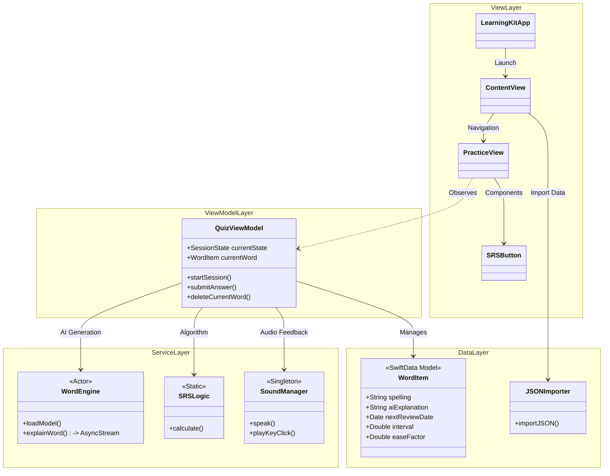
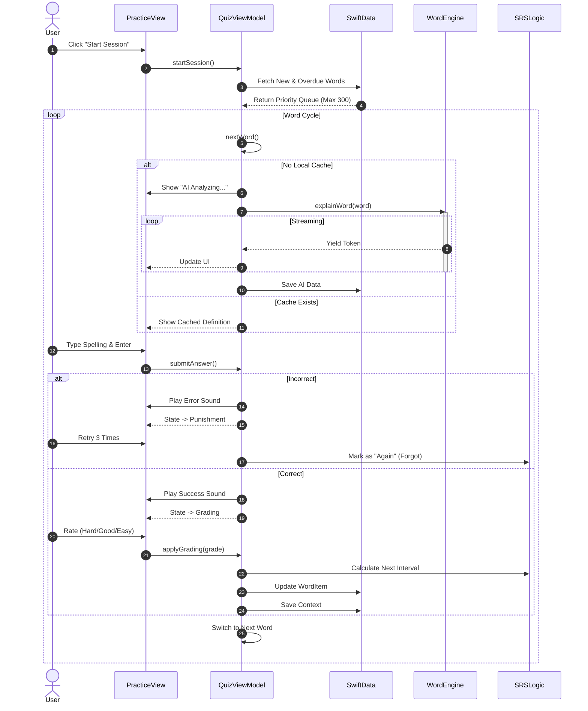
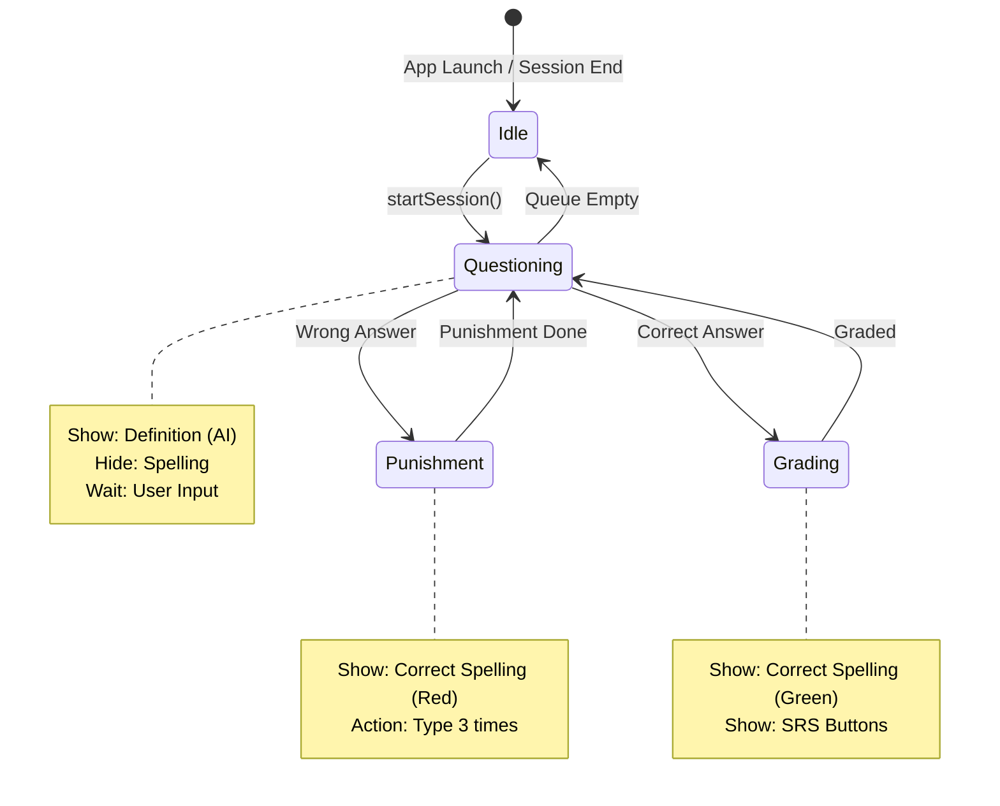

# LearningKit 

**A Native macOS Vocabulary Trainer for Geeks.**

LearningKit is a high-intensity, immersion-focused vocabulary training application built natively for macOS. It abandons the passive "flashcard flipping" model in favor of **active recall** and **keyboard muscle memory**, powered by on-device Local LLMs.

---

## 🚀 Why LearningKit?

### The Problem
* **Passive Learning**: Most apps just ask you to "select" or "look" at a word. You recognize it, but you can't spell it.
* **Static Definitions**: Dictionary definitions are often dry and lack context.
* **Privacy Concerns**: Your learning data is locked in cloud servers.

### The Solution
LearningKit combines **Input-First Learning**, **Spaced Repetition (SRS)**, and **Local AI** to create a private, efficient, and geeky learning environment.

### ✨ Key Features

* **⌨️ Immersive Keyboard Interaction**
    * **Muscle Memory**: Mandatory full-word typing. You can't skip until you spell it right.
    * **Haptic Feedback**: Satisfying mechanical keyboard sound effects built-in.
    * **Punishment Mode**: If you make a mistake, you must type the word correctly 3 times before moving on.

* **🤖 On-Device AI Tutor (Powered by MLX)**
    * **Local Intelligence**: Runs Llama 3 (or other models) locally using Apple's MLX framework. No internet required, no API fees.
    * **Lazy Completion**: Imports can be simple. The AI automatically generates definitions, synonyms, and example sentences during your review sessions.
    * **Structured Data**: Parses unstructured AI output into strict JSON for database storage.

* **🧠 Scientific Memory Algorithm (SM-2)**
    * Implements the classic **SuperMemo-2** algorithm.
    * Dynamic scheduling based on your feedback (Again, Hard, Good, Easy).
    * **Smart Queue**: Prioritizes new words first, then overdue reviews. Limits sessions to 300 words to prevent burnout.

* **📂 Bring Your Own Data (BYOD)**
    * Import your own vocabulary lists via JSON (e.g., from Youdao, Kindle).
    * All data is stored locally in `Application Support` via SwiftData.
    * One-click delete/archive for words you already know.

---

## 🏗 System Architecture

LearningKit is built with **Swift 5.10+** and **SwiftUI**, following the MVVM pattern with Actor-based concurrency for AI tasks.

### Tech Stack
* **UI**: SwiftUI (ZStack Layered Layout)
* **Data**: SwiftData (SQLite)
* **AI Engine**: [MLX Swift](https://github.com/ml-explore/mlx-swift)
* **Concurrency**: Swift Actors & Async/Await

### 1. Class Structure




### 2. Core Data Flow (The Review Loop)
This diagram illustrates what happens when you click "Start Session".

### 3. Application State Machine


# 🛠 Getting Started

### Prerequisites
- Hardware: Mac with Apple Silicon (M1/M2/M3 chips) is required for MLX acceleration.

- OS: macOS 14.0 (Sonoma) or later.

- Tools: Xcode 15+.

### Installation
- Clone the repository
- Open in Xcode Double click LearningKit.xcodeproj.
- Prepare the LLM Model
    - Download a quantized Llama 3 model converted for MLX.
    - Recommended: Llama-3-8B-Instruct-4bit from HuggingFace.
    - Note: You do not need to put the model in the project folder. You will select it via the UI.
- Run the App Press Cmd + R to build and run.
### Importing Data

```json
{
  "data": {
    "itemList": [
      {
        "itemId": "unique_id_1",
        "word": "epiphany",
        "trans": "n. a moment of sudden revelation"
      },
      {
        "itemId": "unique_id_2",
        "word": "serendipity",
        "trans": "n. the occurrence of events by chance in a happy way"
      }
    ]
  }
}
```

Click the Import JSON button in the toolbar.

Select your JSON file.

Click the CPU Icon to select your downloaded LLM model folder.

Start your session!

### 🔮 Roadmap
- [x] MVP: Core Loop, SRS, Local AI.

- [x] Progress Bar & Word Deletion.

- [ ] Heatmap: GitHub-style contribution graph to track daily learning streaks.

- [ ] Charts: Visualizing memory retention rates.

- [ ] Theme Support: More customization for the typing interface.